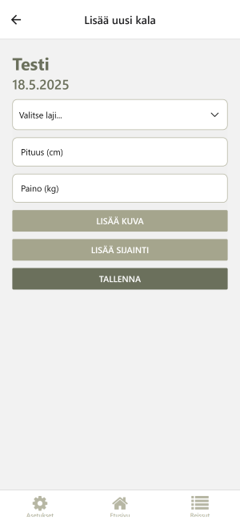

# Fishing Trip App (WIP 🎣)

A simple mobile app for planning and logging fishing trips. Built with **Expo**, **React Native**, and **TypeScript**.

> 🚧 This project is a **work in progress** and currently under active development. Most core features are not yet fully implemented. It is currently focused on **UI layout and navigation structure**, with only temporary local state and mock data used. No backend functionality or user authentication has been implemented yet.

## Planned Features include...

- Trip creation with location and date
- Adding catches with species, weight, and photos
- Viewing past trips and statistics
- Firebase authentication and cloud sync (coming later)

## Current Status

Right now, the app includes:

- Basic UI for trip and catch input
- Local state management (placeholder only)
- Navigation structure using **Expo Router**

## Tech Stack

- Expo (React Native)
- TypeScript
- Expo Router
- (Planned) Firebase

## Screenshots

### Home screen

### Trip Details screen

### Add trip screen

## License

MIT
